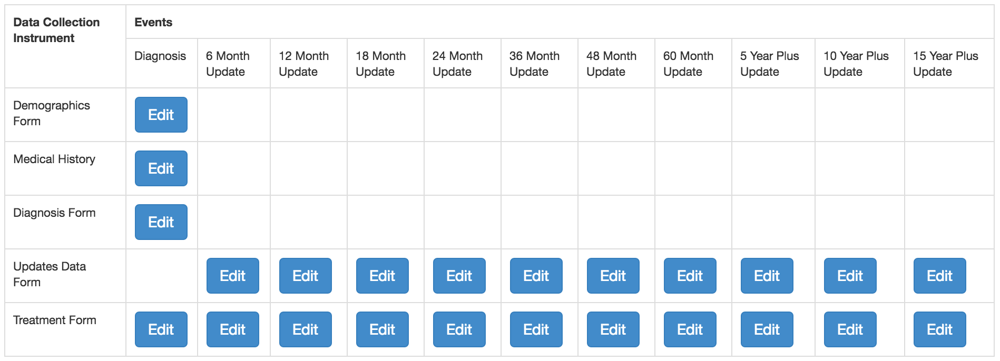

Configuring a REDCap Data Source
================================

REDCap driver configurations are stored as a JSON string:

Single Survey or Data Entry Forms Classic (i.e. non longitudinal)
-----------------------------------------------------------------

.. code-block:: json

    {
        "form_names":["value", ...],
        "labels": [1,2, ...]
    }

* form_names: List[String] containing the REDCap form names that you would like to configure for data entry.
* labels: List[Integer] an array of IDs which correspond to external record labels defined in the electronic Honest Broker.

Data Entry Longitudinal
-----------------------

.. code-block:: json

    {
        "unique_event_names":["value", ...],
        "event_labels":["value", ...],
        "form_data":{"form_name":[0,1,...], ...},
        "labels": [1,2, ...]
        "form_order": ["0_0","1_0","M_N"]
    }

* unique_event_names: List[String] , the event names for this REDCap project
* event_labels : List[String]
* form_event_data : dictionary of the form {"form_label":[Booleans] where the number of Booleans should be the same as the number of events and the value indicates if this form should be available for that event
* labels: List[Integer] an array of IDs which correspond to external record labels defined in the electronic Honest Broker.
* form_order: List[String] An array of form spec strings in the form M_N where M is the form number and N is the event number. This drives the "Save and Continue" functionality of the REDCap driver, defining the order in which forms should be filled out.

Example Configuration
---------------------

Below is a fairly complex example for an actual longitudinal protocol.

.. code-block:: json

    {
        "unique_event_names": [
            "diagnosis_arm_1",
            "6_month_update_arm_1",
            "12_month_update_arm_1",
            "18_month_update_arm_1",
            "24_month_update_arm_1",
            "36_month_update_arm_1",
            "48_month_update_arm_1",
            "60_month_update_arm_1",
            "5_year_plus_update_arm_1",
            "10_year_plus_updat_arm_1",
            "15_year_plus_updat_arm_1"
        ],
        "event_labels": [
            "Diagnosis",
            "6 Month Update",
            "12 Month Update",
            "18 Month Update",
            "24 Month Update",
            "36 Month Update",
            "48 Month Update",
            "60 Month Update",
            "5 Year Plus Update",
            "10 Year Plus Update",
            "15 Year Plus Update"
        ],
        "form_data": {
            "demographics_form": [1,0,0,0,0,0,0,0,0,0,0],
            "medical_history": [1,0,0,0,0,0,0,0,0,0,0],
            "diagnosis_form": [1,0,0,0,0,0,0,0,0,0,0],
            "updates_data_form": [0,1,1,1,1,1,1,1,1,1,1],
            "treatment_form": [1,1,1,1,1,1,1,1,1,1,1]
        },
        "record_id_field_name": "study_id",
        "form_order": [
            "0_0",
            "1_0",
            "2_0",
            "4_0",
            "3_1",
            "4_1",
            "3_2",
            "4_2",
            "3_3",
            "4_3",
            "3_4",
            "4_4",
            "3_5",
            "4_5",
            "3_6",
            "4_6",
            "3_7",
            "4_7",
            "3_8",
            "4_8",
            "3_9",
            "4_9",
            "3_10",
            "4_10"
        ],
        "labels": [
            1,
            2,
            3,
            4,
            5,
            6,
            7,
            8,
            9,
            18,
            19,
            20,
            21,
            22,
            23,
            24
        ]
    }

Event labels correspond to the unique event names defined in REDCap.

Form data contains an object with keys for each form in the project that we wish to enable data capture on.

.. note:: You do not have to include every form available on a REDCap project -- only the ones you wish to expose.

Each form has an array of integers that should correspond to the length of events defined. In this example, under demographics_form a 1 at the zero index of the array signifies that we want to allow for data capture on the diagnosis_arm_1 event for this form. The rest of the array being defined as zeroes makes this form unavailable for the rest of the events defined. Conversely, updates_data_form is made available for all events *except* diagnosis_arm_1.

record_id_field is set to study_id which is different than REDCap's default record_id field.

form_order defines a workflow that the study team has defined to make things easier for those performing data entry. In this case the form order has users first filling out the Demographics form, on clicking "Save and Continue" within that form the user will be taken to the Medical History form, then Diagnosis, and so on.

This Protocol defines several labels available for External Records created under this Protocol Data Source. This array of IDs correspond to labels defined in the electronic Honest Broker.

The configuration above will render a REDCap form matrix like so:

