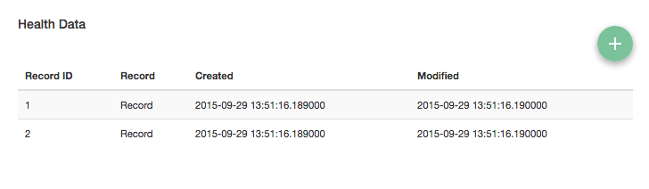

Record Labels
-------------

The Biorepository Portal has the ability to associate external records with
labels defined in the electronic Honest Broker. By default, external records
are displayed as "Record" in the Subject Detail screen.

To associate records with labels defined in the electronic Honest Broker the
Protocol Data Source configuration must be updated. This configuration is a JSON
string that can be modified using Django's admin interface.

First, add the External Record Label you wish to use in the electronic Honest Broker. Note the ID and add it to the "labels" key in the Protocol Data Source JSON configuration.

.. code-block:: json

    {
        "unique_event_names": [...],
        "event_labels": [...],
        "form_data": {
            "baseline_visit_data": [...],
            "meal_description_form": [...]
        },
        "record_id_field_name": "study_id",
        "labels": [3],
        "links": [1,2]
    }

Each Protocol Data Source must be configured individually to use a set of record labels.
