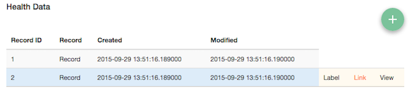
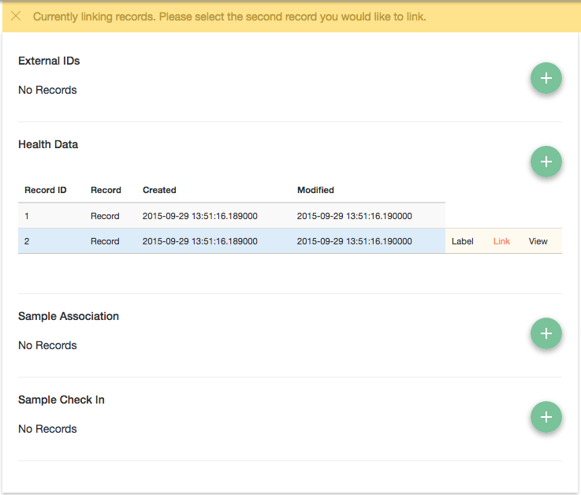
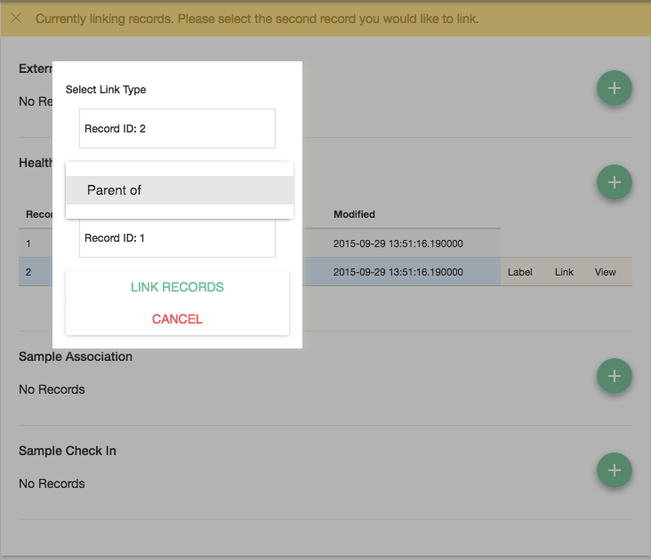
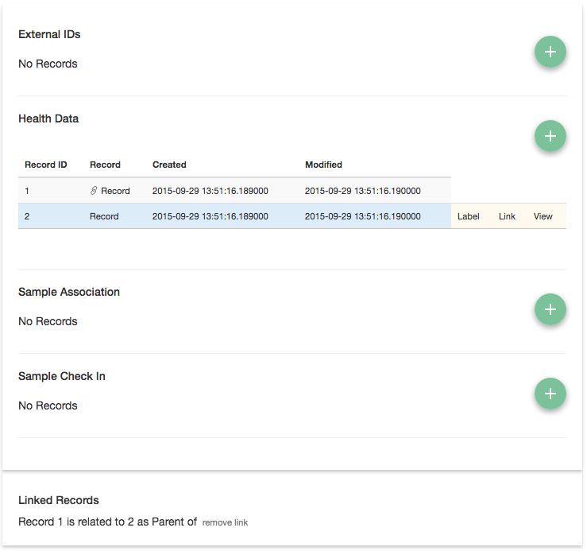

Record Links
------------

The Biorepository Portal has the ability to create links between External Records that are stored in the electronic Honest Broker.

Like Record Labels, Record Links are defined in the electronic Honest Broker as "Relations" and configured per Protocol Data Source via the Protocol Data Source JSON configuration.

The electronic Honest Broker defines relations with a type, and an arbitrary descriptor. The available types are

* Generic
* Label
* File
* Familial
* Diagnosis

An example Relation defined in the eHB might be of the form

.. code-block:: json

    {
        "id": 1,
        "typ": 2,
        "desc": "Parent of"
    }

In the Protocol Data Source configuration you would define the "links" key with ID of the relation you wish to use.

Links defined in a Protocol Data Source configuration allow for records created in that Protocol Data Source to be established as the Primary record in a link.

In other words, for the example above, our PDS configuration would be

.. code-block:: json

    {
        "unique_event_names": [...],
        "event_labels": [...],
        "form_data": {
            "baseline_visit_data": [...],
            "meal_description_form": [...]
        },
        "record_id_field_name": "study_id",
        "labels": [3],
        "links": [1]
    }

After activating a record you can activate "link mode" by selecting "link"

Which will bring you into link mode

Selecting another link will prompt you to select the type of link. Note the directionality: Record 2 (the first record selected) is being linked to Record 1 with a link of "Parent of"

Once the link is created, a link icon will be displayed next to records that are linked to the current active record and the links will be listed below the Protocol Data Sources. Multiple links may be made to a single record.

