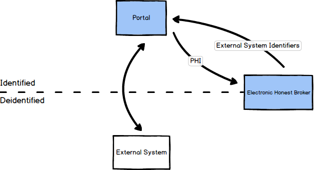

Introduction
================================================

The Biorepository Portal (BRP) is the main client for the Electronic Honest Broker.
It provides an interface that displays protocols with associated patients and systems
(also called datasources) that each patient has a record in. It can also, depending
on the datasource driver, provide an interface within the application to that
datasource, or link out to the system externally.

An example of an application
embedded within the driver would be the REDCap form interface provided within the
BRP. An example of a driver that just links out to an external system is the
phenotype intake driver.

Workflow
--------

A user logs into the BRP and sees a list of Projects (Protocols) they have
access to, which is determined by Protocol User objects.

They click on a Protocol and see a list of Patients in that protocol.
Next to each patient, there is a button for each external system
(also called Datasource) on that Protocol. These buttons are configured by
creating a Protocol Datasource object. Whether or not a button is enabled
(clickable) depends on whether the logged in user has credentials in the system
for the associated Datasource, which is configured by creating a Protocol User
Credentials object. This associates a User and a Protocol Datasource (see the
next section for details). Clicking on a given button brings up a page with a
list of records that the patient has on that external system (or shows an empty
list if the patient has no records yet), and a button to create a new record.

Clicking on a given record in that list opens up a page controlled by the
datasource driver. This could show an entire embedded application (in the case
of the REDCap driver) or just link out to an external system.
